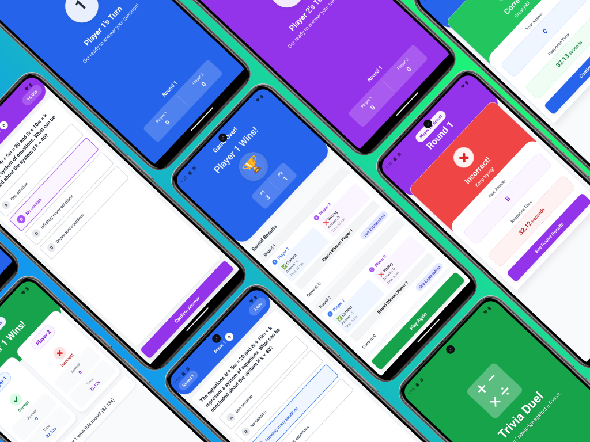

# Trivia Duel Game

A modern, competitive trivia game where players go head-to-head in knowledge-based duels. With its sleek mobile interface and dynamic scoring system, players can engage in exciting rounds of questions while tracking their progress in real-time.

<div align="center">
  
  
  *Multiple game screens showing the trivia duel interface, including player turns, question rounds, and scoring system*
</div>

## Features

- **1v1 Duels**: Direct player-versus-player competition format
- **Round-Based System**: Multiple rounds with clear progression tracking
- **Real-Time Scoring**: Dynamic score display showing points (e.g., "32:12 seconds")
- **Interactive UI Elements**:
  - Round indicators showing current progress
  - Trophy animations for winners
  - Plus/minus scoring indicators
  - Clean, card-based question interface

## Game Interface

### Player Screens
- **Round Display**: Clear indication of current round (e.g., "Round 1")
- **Score Counter**: Real-time point tracking for both players
- **Question Cards**: Clean, white cards displaying trivia questions
- **Answer Interface**: Multiple choice answer selection system
- **Progress Tracking**: Visual indicators for completed rounds

### Color Scheme
- **Primary Colors**:
  - Royal Blue: Player 1's interface
  - Purple: Active game screens
  - Green: Success and confirmation screens
  - Red: Incorrect answer feedback
- **White Cards**: Question and answer displays
- **High Contrast Text**: Ensuring readability

## Game Flow

1. **Match Start**: Players are paired for their duel
2. **Question Rounds**: 
   - Multiple rounds of trivia questions
   - Timed responses with second counting
   - Immediate score feedback
3. **Score Tracking**:
   - Points awarded based on speed and accuracy
   - Running total displayed throughout the match
4. **Round Completion**: 
   - Clear round progression indicators
   - Trophy animations for round winners

## Technical Implementation

Built as a modern web application with:
- Mobile-first responsive design
- Real-time score updates
- Smooth transitions between rounds
- Touch-optimized interface

## Getting Started

### Prerequisites

- Node.js (v18 or higher)
- npm or yarn
- Expo CLI (`npm install -g expo-cli`)
- For mobile development:
  - iOS: XCode (Mac only)
  - Android: Android Studio with SDK

### Installation

1. Clone the repository:
   ```bash
   git clone https://github.com/QbombQ/Trivia-React-Native-Game.git
   cd Trivia-React-Native-Game
   ```

2. Install dependencies:
   ```bash
   npm install
   ```

3. Start the development server:
   ```bash
   npm start
   ```

### Running the App

- For iOS:
  ```bash
  npx expo run:iOS
  ```

- For Android:
  ```bash
  npx expo run:android
  ```


### Development Scripts

- `npm start` - Start the Expo development server
- `npm run lint` - Run ESLint and Prettier checks
- `npm run format` - Format code using ESLint and Prettier
- `npm run prebuild` - Run Expo prebuild configuration
